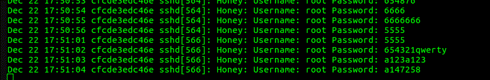

# honeypot

Code inspired (and mostly taken directly from) this [post](https://hackernoon.com/how-ive-captured-all-passwords-trying-to-ssh-into-my-server-d26a2a6263ec) by Jerry Garcia. Jerry also has a follow up [post](https://hackernoon.com/how-i-allowed-hackers-to-ssh-into-my-server-8e59984a491b) on how to allow "hackers" to ssh into your container. The code used can be found [here](https://github.com/bechampion/honey).  

# What is a "honeypot" ?

"In computer terminology, a honeypot is a computer security mechanism set to detect, deflect, or, in some manner, counteract attempts at unauthorized use of information systems. Generally, a honeypot consists of data (for example, in a network site) that appears to be a legitimate part of the site, but is actually isolated and monitored, and that seems to contain information or a resource of value to attackers, who are then blocked. This is similar to police sting operations, colloquially known as "baiting," a suspect." [Wikipedia](https://en.wikipedia.org/wiki/Honeypot_(computing))

# How to build a simple honeypot

In Jerrys post linked above he provides the commands and detailed instructions on how to setup a honeypot to log ssh attempts.  I simply stuck these commands into a Ubuntu based Dockerfile.

# Usage

Clone this repo and build the image :
```
docker build -t ssh_honeypot:latest .
```

Start the container :
```
docker run -p 22:22 --name honeypot -dt ssh_honeypot:latest
```

Check the logs :

You can exec into the container and check the /var/log/auth.log for full logging output including source IP or run :
```
docker logs -f honeypot
```

Example Output :
```
Starting rsyslog
 * Starting enhanced syslogd rsyslogd                                    [ OK ] 
Starting sshd
Checking ps
UID        PID  PPID  C STIME TTY          TIME CMD
root         1     0  0 15:29 pts/0    00:00:00 /bin/sh -c /tmp/start_honeypot.s
root         7     1  0 15:29 pts/0    00:00:00 /bin/bash /tmp/start_honeypot.sh
syslog      24     1  0 15:29 ?        00:00:00 /usr/sbin/rsyslogd
root        31     1  0 15:29 ?        00:00:00 /opt/openssh2/dist/sbin/sshd -f 
root        32     7  0 15:29 pts/0    00:00:00 ps -ef
Tailing auth.log for login attempts
Dec 21 15:59:38 cfcde3edc46e sshd[52]: Honey: Username: root Password: admintrup
Dec 21 15:59:38 cfcde3edc46e sshd[52]: Honey: Username: root Password: admintrup
Dec 21 15:59:39 cfcde3edc46e sshd[52]: Honey: Username: root Password: admintrup
Dec 21 15:59:39 cfcde3edc46e sshd[52]: Honey: Username: root Password: rpitc
Dec 21 15:59:40 cfcde3edc46e sshd[52]: Honey: Username: root Password: openelec
Dec 21 15:59:40 cfcde3edc46e sshd[52]: Honey: Username: root Password: system

```



Using the source IP and this [site](http://ipheatmap.azurewebsites.net) you can generate a Heatmap.  

## Find the location of the source IP 

curl -X GET http://ip-api.com/json/103.217.152.20
```
{"as":"AS135259 SKYLINE INFONET PRIVATE LIMITED","city":"Sīkar","country":"India","countryCode":"IN","isp":"Skyline Infonet Private Limited","lat":27.6126,"lon":75.1457,"org":"Skyline Infonet Private Limited","query":"103.217.152.20","region":"","regionName":"Rajasthan","status":"success","timezone":"Asia/Kolkata","zip":""}
```

## Port and OS scan using nmap

```
nmap --top-ports 1000 -T4 -sC 218.65.30.126
nmap -O -v 218.65.30.126
```

That's as far as I've got. Thanks Jerry for your posts. Future plans include port scanning source IPs to see which ports are open out of curiosity.
